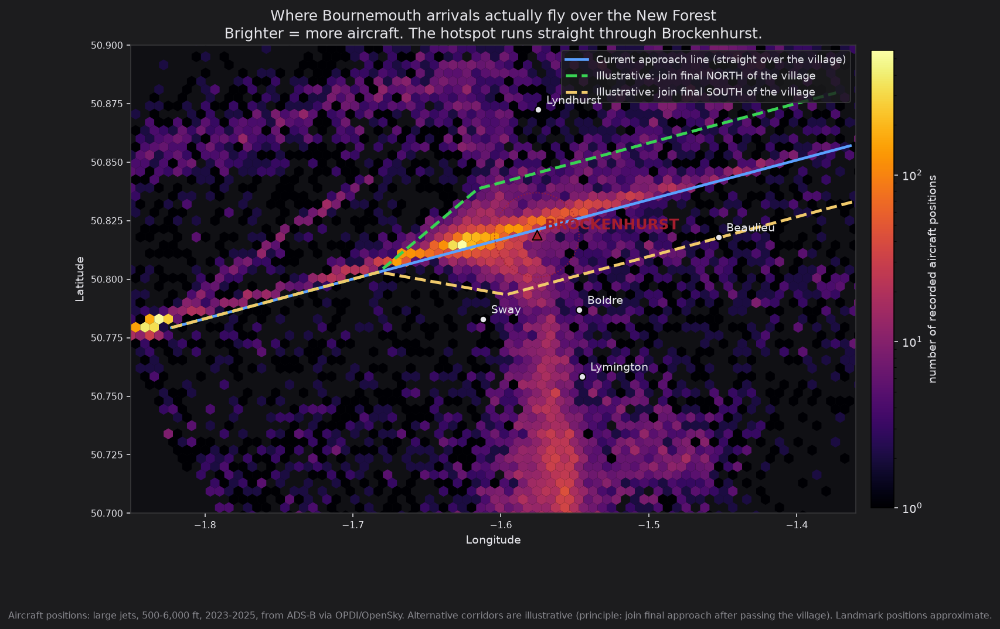
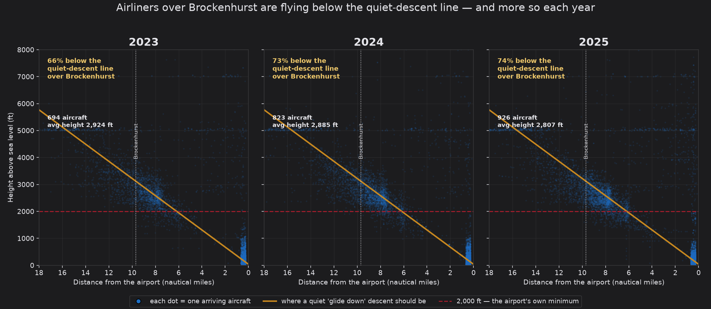
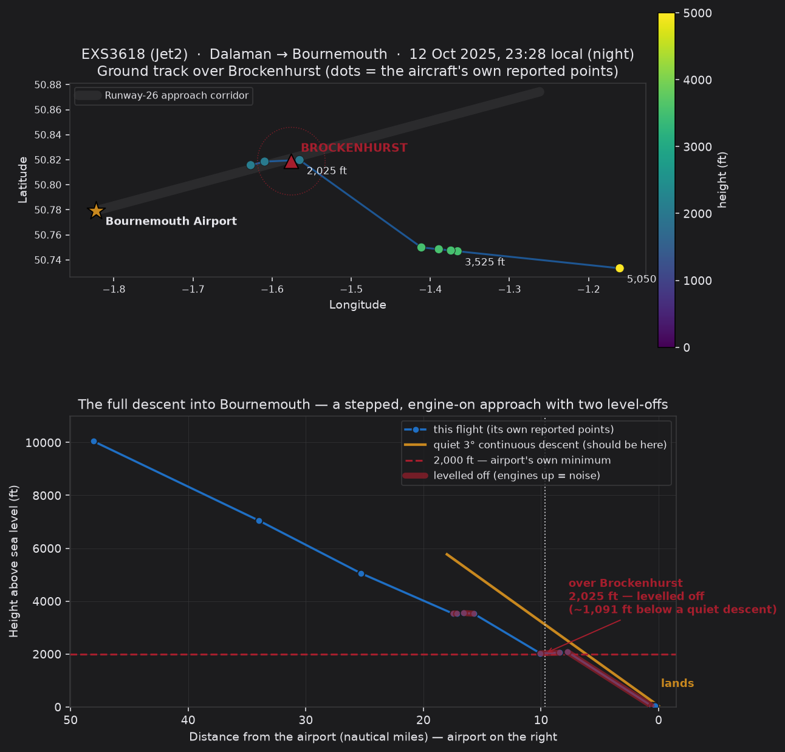
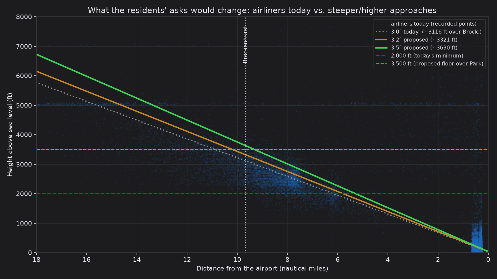

# Environmental evidence annex

## ACP‑2019‑43 (Bournemouth FASI‑South) — Runway‑26 arrivals, A26‑ESE design envelope

*Independent supporting evidence for the Brockenhurst Aviation Action Group
(BAAG) Stage 3 consultation submission. Prepared from public flight data,
2023–2025. Not affiliated with the airport.*

> **Purpose.** This annex supplies the **environmental baseline evidence the
> airport's own engagement material does not contain.** The 3rd‑engagement deck
> (Cyrrus, ACP 2019‑43) defines the runway‑26 arrival options **only as lateral
> track "swathes"** — it makes **no assessment of altitude, noise, Brockenhurst,
> or the New Forest National Park.** Using three years of the aircraft's own
> broadcast data, this annex quantifies what is actually happening over
> Brockenhurst on the **A26‑ESE** arrival, and puts numbers behind BAAG's three
> design demands.

---

## 1. The concern, in one line

The **A26‑ESE** design envelope carries runway‑26 arrivals **directly over
Brockenhurst**. The "Do‑Minimum" option **replicates today's tracks using precise
satellite navigation (PBN/RNAV)** — which would **concentrate** today's scattered
overflights into a **single, permanent, low‑altitude line** over the village and
National Park: a "noise highway." The evidence below shows the line already
exists, is flown too low, and is getting worse.

## 2. The environmental baseline the ACP omits (measured, not asserted)

**2.1 Brockenhurst is directly under the A26‑ESE track.** ~**76%** of airliner
arrivals approach over the village (runway‑26 operations). The density map shows
the concentration running straight through Brockenhurst — the "noise highway" as
it is flown today.

**2.2 They are flown lower than a continuous descent.** A standard 3.0° continuous
descent would place aircraft at **~3,116 ft** over Brockenhurst. Measured reality
for airliners: **average ~2,855 ft, median ~2,725 ft.** The share **below** the
continuous‑descent height rose **66% → 73% → 74%** (2023→2025), and the average is
**falling** each year while the number of aircraft **rises**.

**2.3 They step down and level off — the high‑thrust noise event.** A compliant
continuous descent has **no level flight**. Level‑offs over the village (each one
an application of engine power) rose **63 → 95 → 157** per year. Worked example —
a Jet2 arrival, night of **12 Oct 2025**, levelled at **~2,050 ft directly over
Brockenhurst at 23:28**, after also levelling at ~3,500 ft: a stepped, engine‑on
profile, built entirely from the aircraft's own recorded positions.

**2.4 It is worst at night.** Night‑time airliners over Brockenhurst rose
**263 → 332 → 583** (2023→2025); those **below the airport's own 2,000 ft minimum**
rose **0 → 2 → 7**.

## 3. Evidence for BAAG's three design demands

**Demand A — steeper approach (3.0° → 3.2°/3.5°).** A steeper glidepath keeps
aircraft higher over the Park. From our geometry: over Brockenhurst, **3.0° ≈
3,116 ft, 3.2° ≈ 3,320 ft, 3.5° ≈ 3,630 ft.** Against today's ~2,855 ft average,
that is **+470 ft (3.2°) to +775 ft (3.5°)** — before counting the removal of the
low level‑offs. The figure shows today's aircraft (blue) sitting **below** both
proposed slopes.

**Demand B — higher minimum height over the Park (3,500 ft floor).** Today's
average over Brockenhurst (~2,855 ft) is **~650 ft below** a 3,500 ft floor, and a
substantial share are below even the existing 2,000 ft minimum. A hard 3,500 ft
floor over the National Park, combined with **no level‑offs**, is the single
largest noise reduction available and is consistent with the airport's existing
**night rule** (establish no closer than 8 miles / not below 2,500 ft).

**Demand C — lateral offset south of the village.** The density map (2.1) shows
both the concentrated over‑village track **and** that many aircraft already join
from wider out — so an offset is operationally realistic. *Technical precision to
protect the demand:* the **final ~4–5 miles must align with the runway** and
cannot be offset; the offset therefore applies to the **intermediate/joining
segment** (Brockenhurst is ~10 miles out), with aircraft establishing on final
**after** passing the village. PBN makes such a defined offset precise and
repeatable.

## 4. Measured against the airport's own commitments

The above is not our standard — it is the airport's own:

- **Section 106 (planning permission 8/07/0065):** enforce Continuous Descent
  Approaches "wherever possible." *(BAAG to confirm exact wording.)*
- **UK AIP, EGHH AD 2.21:** a *"continuous descent… at all times,"* staying *"as
  high an altitude as practical,"* joining *"without level flight,"* plus a night
  rule (2130–0630) of **8 miles / 2,500 ft**.
- The data in §2 shows these are routinely not met on the A26‑ESE arrival.

## 5. Data, method and honest limitations

- Source: aircraft's own **ADS‑B** broadcasts, 2023–2025, via **OPDI**
  (EUROCONTROL Performance Review Unit) and **OpenSky Network** — **independent of
  the airport**, and **corroborating** the airport's own WebTrak.
- **~97%** of arrivals are captured. Precise over‑village heights come from a
  **representative sample** (~1 in 5 of overflying arrivals), so **all counts are
  minimums** — the true figures are **higher**.
- We do **not** claim every low flight breaches a rule; some have air‑traffic
  reasons. The case is the **consistent, worsening pattern** across thousands of
  flights.
- Full method, definitions and a flight‑by‑flight dataset are available on
  request (documents: *Methodology*; *Data, sources & definitions*; Excel flight
  list).

*Prepared by Brockenhurst residents from public data to support ACP‑2019‑43
Stage 3. Not affiliated with, or endorsed by, Bournemouth Airport.*
