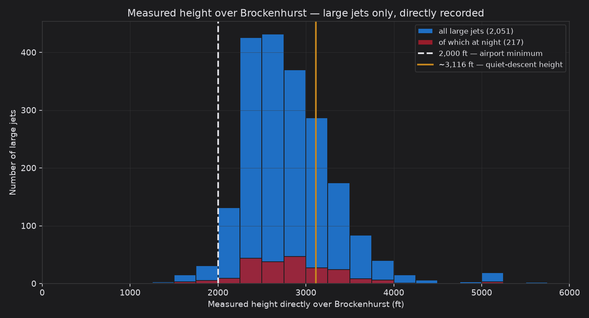

# Facts-only analysis & a worked example

This companion uses **only** flights for which we have a **directly measured
height as the aircraft passed over Brockenhurst** — no estimation, no inference.
It is the ~1-in-6 subset described in `DATA_AND_DEFINITIONS.md`. Every number
below is a recorded altitude from the aircraft's own broadcast.

## 1. Measured heights over Brockenhurst, 2023–2025

| Group | Measured | Median | Below ~3,116 ft | Below 2,000 ft |
|---|---|---|---|---|
| All arrivals | 4,938 | 2,500 ft | 4,233 (86%) | 828 (17%) |
| Large passenger jets | 2,051 | 2,725 ft | 1,551 (76%) | 50 (2%) |
| Large jets at night (23:00–06:00) | 217 | 2,775 ft | 161 (74%) | 9 (4%) |

Read the large-jet row: of **2,051** airliners with a directly measured
height over the village, **1,551** were lower
than a quiet continuous descent would put them, and
**50** were below the airport's own 2,000 ft
minimum — all measured, none inferred.

### Night airliners, measured, year by year

| Year | Measured | Median | Below 2,000 ft |
|---|---|---|---|
| 2023 | 45 | 2,950 ft | 0 |
| 2024 | 69 | 2,750 ft | 2 |
| 2025 | 103 | 2,725 ft | 7 |

## 2. Worked example — a recent night flight

**EXS3618 (Jet2), Dalaman → Bournemouth, night of 12 October 2025.** The aircraft
levelled off at about **2,050 ft directly over Brockenhurst** at **23:28 local**
— roughly **1,050 ft below** where a quiet continuous descent would have it, and
right on the airport's own 2,000 ft minimum. Moments earlier it had also levelled
at ~3,500 ft: a stepped, non-continuous descent rather than a steady glide. Both
the ground track and the height profile below are built purely from the
aircraft's own recorded positions.

*This single flight is an illustration, not the argument on its own — the case is
the consistent pattern across thousands of flights in Section 1. Method, sources
and definitions: DATA_AND_DEFINITIONS.md and METHODOLOGY.md.*
