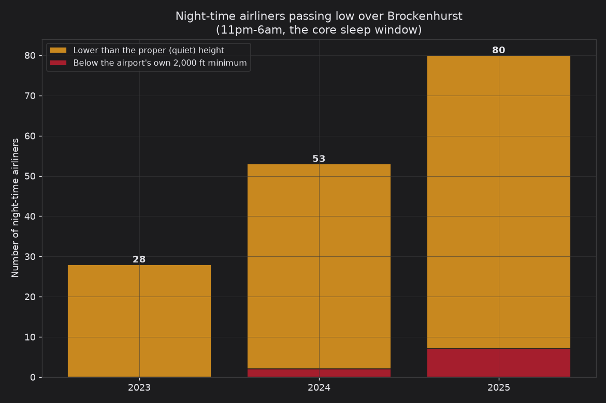
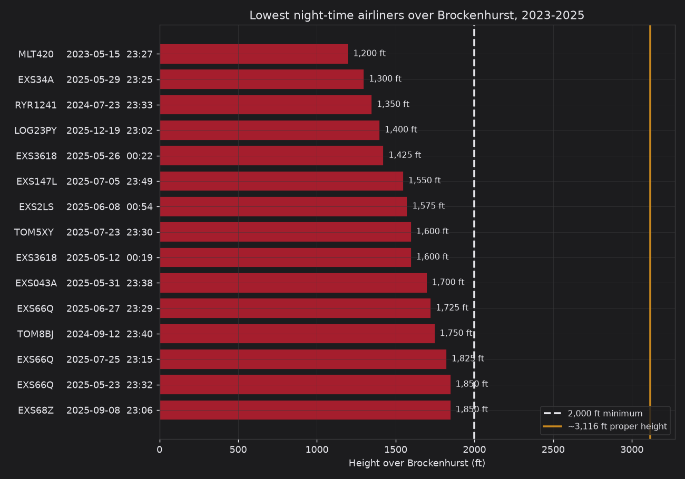
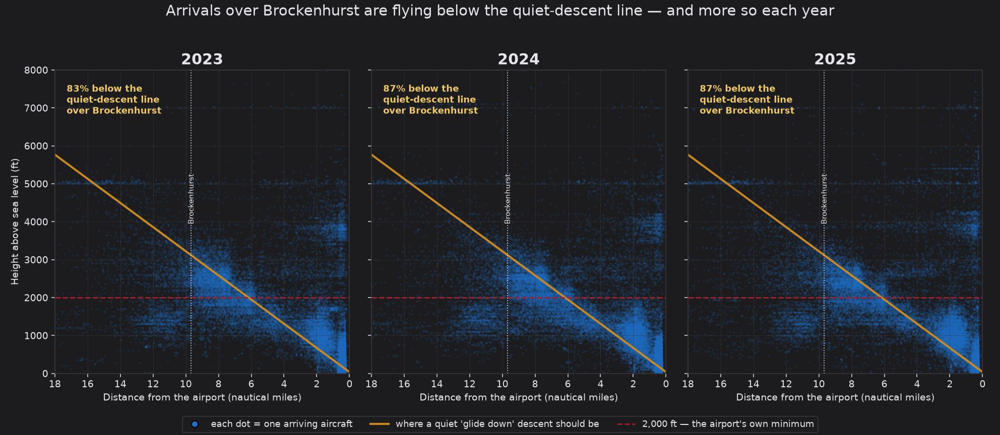
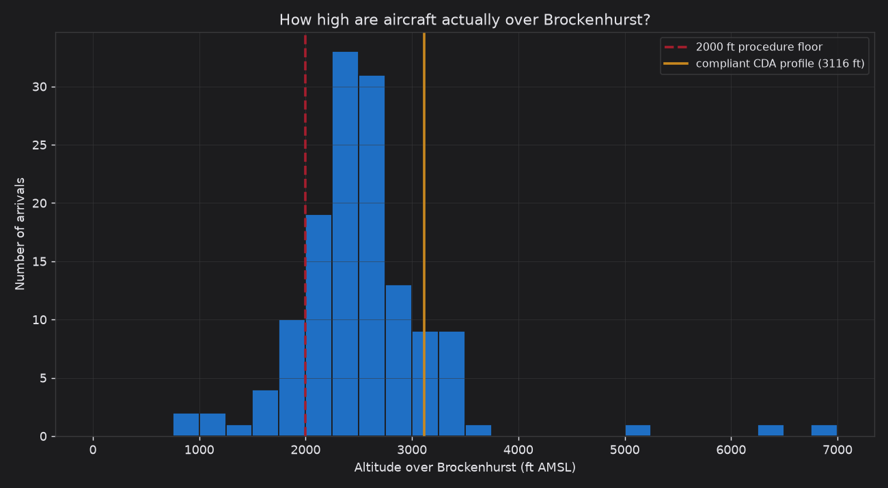
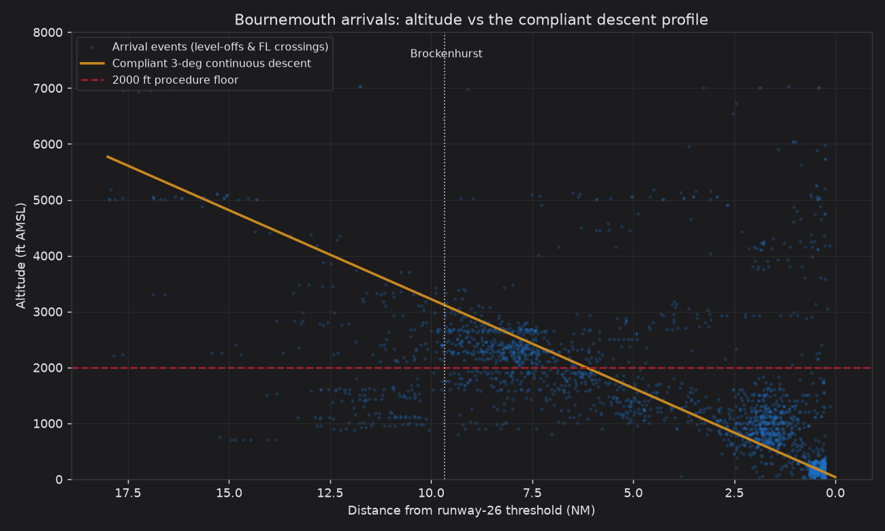

# Bournemouth → Brockenhurst noise compliance

Are aircraft arriving into Bournemouth Airport (EGHH) flying the quiet,
**low-power continuous descent approaches (CDA)** the airport's noise-abatement
rules require — or are they being dragged in **low and level**, adding engine
power (and noise) over Brockenhurst and the New Forest National Park?

This repo answers that with **public ADS-B data** (the aircraft's own reported
altitude), independent of the airport, and produces evidence you can put in front
of the airport, the council, or a consultation response.

> **The data gap this closes:** you had landing times but no mass altitude data
> over Brockenhurst. The OPDI **flight-events** dataset (same source as your
> `last_seen` landing times) contains each aircraft's **actual reported altitude
> and position** on the way in — including where it **levels off**. So the
> overfly height is now *measured*, not estimated as "landing − 3 min".

## What the data shows

### Full 2023–2025 sweep — large jets, night-time focus

33,533 Bournemouth arrivals over three years; 11,586 were large commercial jets.
Focusing on the core sleep window (**11pm–6am**):

| Night-time airliners over Brockenhurst | 2023 | 2024 | 2025 |
|---|---|---|---|
| Tracked with a measured height | 45 | 69 | 103 |
| **Typical (median) height** | 2,950 ft | 2,750 ft | **2,725 ft** |
| Flew **lower than the proper (quiet) height** (~3,116 ft) | 28 | 53 | **80** |
| Flew **below the airport's own 2,000 ft minimum** | 0 | 2 | **7** |
| **Stopped descending (levelled off) over the village** | 63 | 95 | **157** |

The trend is one-directional: **more** night airliners each year, flying
**lower**, **levelling off** over the village more than twice as often, and
breaching the airport's own 2,000 ft floor more often. The lowest individual
night flights are named airliners (Jet2, TUI, Ryanair, Air Malta) at
**1,200–1,750 ft** — e.g. `RYR1241` at 1,350 ft, 23:33 — well below both the
2,000 ft minimum and the ~3,116 ft continuous-descent height.




**Altitude vs the quiet-descent line, year on year** — the share of arrivals
*below* where a continuous descent should have them (near Brockenhurst) rose
**83% → 87% → 87%** (all arrivals) and **66% → 73% → 74%** (airliners):



**Cross-reference with the resident audit:** every airline the June-2026 audit
named is confirmed making low night approaches in the 2023–2025 data — Jet2 down
to 1,300 ft, Ryanair to 1,350 ft, TUI with 131 night flights below the proper
height — the same pattern, some lower than the audit's own ~2,400 ft examples.
(The audit's June-2026 dates are beyond current open-data coverage; the
`URO601/URO901` A340 freighter entries could not be matched to any UK operator
and look unverified.) Plain-English write-up: `outputs/sweep/FINDINGS.md`.

Run it: `python sweep.py --start 2023-01-01 --end 2026-01-01`

**One-page evidence brief:** `python brief.py` composes `outputs/brief.pdf`
(+ `.png`) — a printable, plain-English summary for a complaint, council
submission, MP letter, or consultation response.

**Fuller coverage (optional, OpenSky):** only ~⅓–⅔ of arrivals broadcast a
usable low-level event, so the night counts above are *minimums*. For an exact
over-village height (plus speed and climb/descent rate) for essentially every
night arrival, use the raw OpenSky state vectors:

```bash
# No account needed - live snapshot of aircraft over Brockenhurst right now:
python run_opensky.py --live

# Historical night analysis (needs an OpenSky account):
python run_opensky.py --start "2025-06-08 22:00" --stop "2025-06-09 06:00"
```

Credentials for the historical path: the OpenSky **historical database (Trino)**
uses your account **username + password** — *not* the REST API client_id/secret —
and Trino access must be **granted separately** (opensky-network.org → *My
OpenSky → Request Data Access*). Once granted, set `OPENSKY_USERNAME` (lowercase)
and `OPENSKY_PASSWORD` as **environment variables / secrets** (in Claude Code on
the web, add them to your environment's configuration —
[docs](https://code.claude.com/docs/en/claude-code-on-the-web)). pyopensky reads
them directly, so secrets are never written to a file or committed to git.
(`run_opensky.py --live` needs no account at all.)

### Single-period detail (sample: 4–24 June 2025)

1,318 arrivals; median measured height over Brockenhurst ~2,450 ft vs the
~3,120 ft continuous-descent height; 24% levelled off right over the village;
82% of direct readings below the descent profile, 14% below the 2,000 ft floor.




## Quickstart

```bash
pip install -r requirements.txt

# One ~20-day sample (downloads ~2 OPDI files, caches them in ./data)
python run_opdi.py --start 2025-06-04 --end 2025-06-24

# A full year, large commercial jets only
python run_opdi.py --start 2025-01-01 --end 2026-01-01 --large-jet-only
```

Outputs (in `outputs/`):
- `per_flight.csv` — one row per arrival with measured gate altitude + breach flags
- `summary.json` — headline numbers
- `descent_profile.png`, `gate_altitude_hist.png`, `leveloff_summary.png`

## How it works

```
config.py                 all assumptions in one place (geography, thresholds, classes)
brockenhurst/
  geometry.py             great-circle maths + the 3° compliant-descent profile
  opdi.py                 download/cache OPDI flight_list + flight_events, filter EGHH arrivals
  classify.py             aircraft category (large jet vs business jet vs ...) + day/eve/night
  approach.py             detect level-offs & gate altitudes, flag CDA breaches
  charts.py               dashboard-styled charts (blue/gold/red)
  report.py               plain-English sweep charts, night table, audit cross-reference
  opensky.py              OPTIONAL: dense per-flight altitude from raw OpenSky state vectors
run_opdi.py               CLI: single period → outputs/
sweep.py                  CLI: full multi-year sweep, large-jet + night focus → outputs/sweep/
run_opensky.py            CLI: dense per-flight over-village height (needs OpenSky account)
brief.py                  compose the one-page evidence brief (PDF + PNG) from the sweep
tests/test_geometry.py    geometry & threshold sanity checks
docs/                     the airport's own source documents (noise abatement page, ILS plate, your dashboards)
```

**Read [`METHODOLOGY.md`](METHODOLOGY.md) before quoting any number** — it derives
the geometry and thresholds, ties them to the airport's own published rules
(`docs/noise_abatement_arrivals.jpeg`), explains the WebTrak cross-validation
step, and is honest about the limitations.

## Data sources
- **OPDI** (opdi.aero, EUROCONTROL PRU) — open Parquet derived from OpenSky ADS-B. Used by default; no account needed.
- **OpenSky Network** — raw state vectors for dense per-flight altitude (`brockenhurst/opensky.py`); free account required.
- **Bournemouth WebTrak** — the airport's own published tracks, for spot-check validation.
