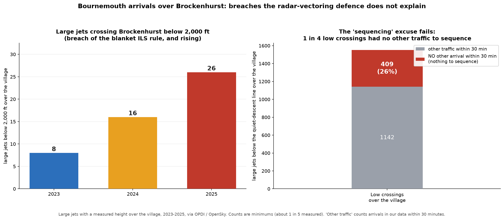

# Response to Bournemouth Airport

## Aircraft noise over Brockenhurst and compliance with AD 2.21

*From the Brockenhurst Community Action Group. Prepared from the aircraft's own
broadcast GPS data (ADS-B), 2023 to 2025, via the public OPDI and OpenSky
datasets. Every figure is independently reproducible. All counts are minimums.*

---

Thank you for your response setting out the distinction between "self-positioning"
and "radar vectoring." We understand the point. However, our concern does not rest
on that distinction, and there are three matters your response does not address.

## 1. Your enforceable Section 106 obligation, which has no vectoring exemption

Your own Section 106 planning agreement (Second Schedule, "Landing Noise") requires
that:

> *"Aircraft making an approach to land at the Airport shall follow a descent path
> which will not result in their being lower at any time than the descent path that
> would be followed by aircraft using the Instrument Landing System."*

This is a binding planning obligation. It applies to **every** aircraft making an
approach to land. It contains **no** distinction between self-positioning and radar
vectoring, and the airport is required (Second Schedule, paragraph 1) to use
reasonable endeavours to ensure it is complied with **at all times**. The Instrument
Landing System descent path is the 3-degree glidepath, which crosses Brockenhurst
(9.7 miles out) at approximately 3,100 ft.

The published AD 2.21 procedure carries the same floor in the same terms: turbine
aircraft and aircraft above 5,700 kg **"shall not descend below 2000 ft QNH before
intercepting the glidepath."** Again, no self-positioning qualification.

Our data shows this is routinely not met:

- **77% of arrivals are below the 3-degree ILS descent path** as they cross the
  village (median height 2,725 ft), so the majority are "lower ... than the descent
  path that would be followed by aircraft using the Instrument Landing System."
- **50 large jets crossed below 2,000 ft**, of which **12 at night**, and rising:
  **8 (2023), 16 (2024), 26 (2025)** — each well before the glidepath intercept
  point.

These are breaches of an enforceable obligation, and of AD 2.21, that your
self-positioning distinction does not touch.

## 2. The "sequencing" justification cannot apply where there is no traffic

Your response states that aircraft "may be tactically descended, levelled or
sequenced ... as part of the safe and orderly management of traffic." Sequencing
requires other traffic to sequence against. We tested this against the arrival
record:

- Of the large jets crossing the village **below the continuous-descent height**,
  **26% (409 flights) had no other arrival within 30 minutes**, and 45% had none
  within 15 minutes.
- **117 low night crossings had no other arrival within 30 minutes.**

Examples, which we invite you to check against your own records:

- **RYR5AM, 9 November 2025, 22:27, about 1,600 ft** over the village, no other
  arrival within 30 minutes.
- **EXS3618 (Jet2), 12 May 2025, 00:19, about 1,600 ft**, no other arrival within
  30 minutes.
- **LAV932P (AlbaStar), 9 August 2025, 21:56, about 1,675 ft**, no other arrival
  within 30 minutes.

A single aircraft brought to 1,600 ft over a National Park village at night, with no
other traffic in the sky, cannot be explained as the orderly management of traffic.

## 3. "As high as practicable" is not being met, on your own standard

Your response accepts that the continuous-descent provision requires aircraft to
"remain as high as practicable and use low-power, low-drag techniques where
operationally possible." We hold you to exactly that standard. Our data shows it is
routinely not met:

- The **median height over the village is 2,725 ft**, and **77% of arrivals are
  below the 3,116 ft continuous-descent height.**
- **44% of arrivals level off** during the approach, a level segment requires added
  thrust and drag, the opposite of "low-power, low-drag." **561 of those level-offs
  occurred with no other traffic within 30 minutes.**

This is not an occasional operational exception. It is the standard method of
operation, and it is worsening year on year.

## On "altitude in isolation"

You state that altitude over Brockenhurst cannot, in isolation, demonstrate a breach.
We do not rely on a single point. We hold the **complete descent profile** for
individual flights, from cruise to touchdown, showing the stepped, levelled
approaches directly. And the geometry is not in dispute: an aircraft at 1,600 ft at
9.7 miles is physically incapable of being on a compliant continuous descent, which
would place it at approximately 3,100 ft at that point. It has descended below the
profile and can only remain low.

The two example flights previously raised (RYR22ZK and 2ANJA) have since been
confirmed against a **second, independent data source**, which addresses the concern
that third-party data cannot be relied upon.

## What we ask

1. Review the **named sub-2,000 ft flights** against your Noise and Track Keeping
   (NTK) radar logs and provide, for each, the recorded height over Brockenhurst and
   the specific traffic situation said to justify it.
2. Confirm that "as high as practicable" and continuous descent will be applied to
   **all** arrivals, including those under radar vectors, consistent with your own
   description of the provision.
3. Reflect these commitments in the live airspace change (ACP-2019-43), which is the
   opportunity to resolve this for the long term.

---

*Data note: heights over the village are measured for approximately 1 in 5 arrivals
(those broadcasting a position directly overhead), so all counts above are minimums;
the true figures are higher. "No other arrival within 30 minutes" is measured against
arrivals in the public data and is offered as a strong indicator, which is why we ask
you to confirm the traffic situation for each flight. Sub-2,000 ft figures are
barometric; the lowest examples cited are robust to any pressure adjustment.*
