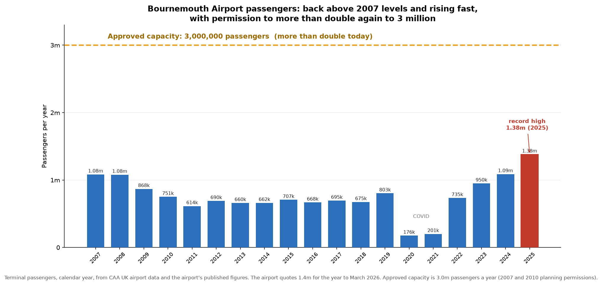
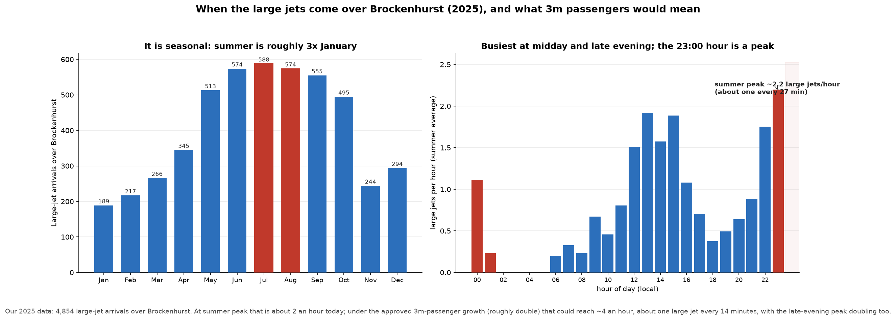

# Section 1 — the data, and how solid it is

*Prepared for the Brockenhurst residents' pack. Every figure below comes from the
aircraft's own broadcast GPS data (via the public OPDI and OpenSky datasets) or
from published CAA / planning figures. It is independent of the airport, and every
chart can be reproduced.*

---

## More flights, and permission for far more

Bournemouth was already carrying about 1.08 million passengers in 2007–08. It fell
back through the 2010s, crashed in COVID, and has since recovered fast to a
**record 1.38 million in 2025**. The airport holds permission to **more than double
again, to 3 million**.

> **Our own flight data shows the same climb.** Between 2023 and 2025, arrivals into
> Bournemouth rose **28%** (9,819 → 12,574), and the large jets that overfly
> Brockenhurst rose **65%** (2,943 → 4,854) — more than twice as fast as flights
> overall.

## Concentrated at the worst times, and set to double

The flights are not spread evenly. Summer is roughly **three times** January, and
the day has two peaks: **midday and late evening, with 23:00 a genuine peak** and
traffic continuing after midnight.

> **What 3 million passengers would mean.** At summer peak today, about **2 large
> jets an hour** cross the village. Under the approved growth that could roughly
> **double to one every 15 minutes at peak**, with the late-evening peak doubling
> too.

---

## What we can prove, and how solid it is

> **Independent data.** Every height, route and count comes from the aircraft's own
> broadcast GPS (ADS-B), via two public datasets (OPDI and OpenSky). It does not rely
> on anything the airport tells us, and every chart can be reproduced.
>
> **Solid where it matters.** Detailed height and route evidence covers **three full
> years (2023 to 2025)**. Passenger history (2007 to 2025) is from **CAA statistics**,
> cross-checked against two further sources. The 3 million cap is from the airport's
> **2007 and 2010 planning permissions**.
>
> **We under-claim on purpose.** We can pin an exact height over the village for about
> **1 in 5** arrivals (it depends on when each aircraft happened to broadcast a
> position). So our counts are **minimums** — the real numbers are higher, not lower.
>
> **What we deliberately do not claim.** We do not say every low flight breaks a rule.
> We do not rely on European Cargo (now in administration). We do not use pre-2022
> flight-track data, because reliable low-level tracking did not exist then. If a
> number cannot be verified, it is not in here.

*Sources: UK CAA airport statistics (passengers and the growth trajectory);
Bournemouth Airport 2007 and 2010 planning permissions (3m cap); OPDI (EUROCONTROL)
and OpenSky (aircraft GPS tracks, 2023–2025). Full method and definitions available
on request.*
